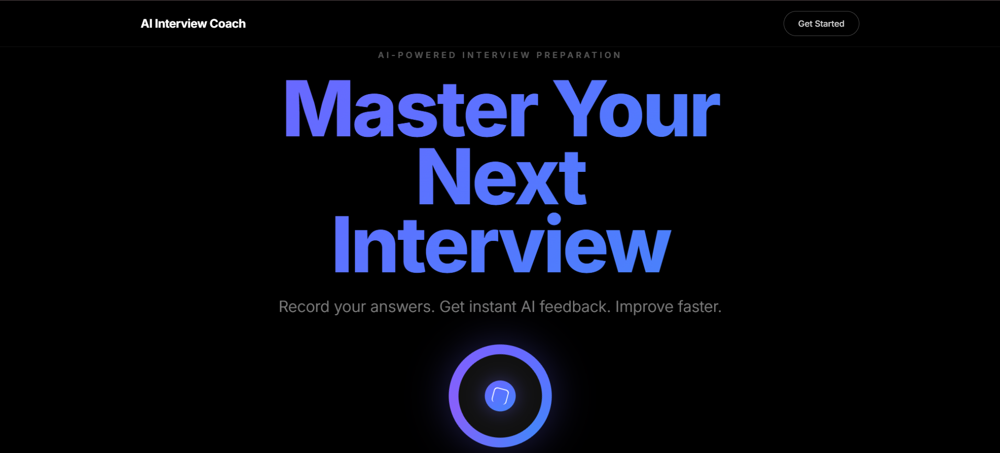

# 🎙️ AI Interview Coach

A full-stack AI-powered interview preparation platform that helps candidates practice, analyze, and improve their interview performance — with real-time speech analysis, webcam body language feedback, LLM-generated coaching, and guided mock interviews.

## 🖥️ Application Preview



---

## 🚀 Features

- **Guided Mock Interviews** — End-to-end AI-driven sessions with dynamically generated questions tailored to your target role, company, and experience level
- **Live Interview Mode** — Real-time recording, transcription, and instant per-answer feedback during practice sessions
- **Speech Analysis Engine** — Deep metrics on speaking rate (WPM), filler words, pause patterns, vocabulary variety, pitch variation, and voice energy
- **Webcam Body Language Analysis** — Tracks eye contact, head movement, and hand gestures using MediaPipe Face Mesh and Hands
- **LLM Coaching Feedback** — Personalized, actionable coaching generated via Groq (LLaMA) and Grok (xAI) APIs based on your transcript and speech metrics
- **Resume-Aware Interviews** — Upload your CV and the AI tailors questions and feedback to your actual background
- **Session Analytics Dashboard** — Track scores, confidence trends, fluency progress, and composure across all your sessions
- **Text & Voice Interview Modes** — Choose typed responses or spoken answers with OpenAI Whisper transcription
- **ElevenLabs Voice Synthesis** — AI interviewer speaks questions aloud with configurable voice personas
- **Company Intelligence** — Target-company-specific question generation and interview difficulty calibration
- **Session History** — Browse all past interviews with scores, durations, and detailed per-question breakdowns
- **User Profiles & Onboarding** — Career context (role, industry, seniority, experience) used to personalize every session

---

## 🧠 AI & Analysis Modules

### 🎤 Speech Analysis (`analysis_service.py`)
Extracts rich temporal, fluency, lexical, and acoustic features from audio:

| Metric | Description |
|---|---|
| Speaking Rate | Words per minute (ideal: 120–160 WPM) |
| Long Pauses | Pauses exceeding 1.2 seconds |
| Filler Words | "um", "uh", "like", "you know", etc. |
| Word Repetitions | Detected repeated phrases |
| Hedging Language | "maybe", "I think", "probably" |
| Vocabulary Variety | Type-Token Ratio (TTR) |
| Pitch Variation | Standard deviation of vocal pitch (Hz) |
| Voice Energy | RMS energy mean across the recording |

### 👁️ Webcam Analysis (`webcam_service.py`)
Real-time posture and non-verbal feedback using OpenCV + MediaPipe:
- **Face Mesh** — Eye contact tracking, head tilt, gaze direction
- **Hand Tracking** — Gesture frequency and excessive movement detection
- **Movement Suggestions** — Live coaching tips for body language improvement

### 🤖 Intelligence Service (`intelligence_service.py`)
Dual-LLM pipeline for question generation and answer evaluation:
- **Groq (LLaMA)** — Fast, structured interview question generation
- **Grok (xAI)** — Answer quality scoring and contextual follow-up questions
- **NLP Analysis** — Keyword extraction, answer completeness, and content scoring
- **Clarifying Questions** — AI asks follow-ups before the interview to personalise the session
- **Interview Summary** — Full post-session report with overall score, strengths, and improvement areas

---

## 🗂️ Project Structure

```
Ai Interview Coach/
│
├── backend/
│   ├── app/
│   │   ├── main.py                    # FastAPI entry point, Whisper model loader
│   │   ├── config.py                  # Environment configuration
│   │   ├── database.py                # SQLAlchemy engine & session
│   │   ├── models.py                  # ORM models (User, Session, Recording, GuidedInterview, etc.)
│   │   ├── schemas.py                 # Pydantic request/response schemas
│   │   │
│   │   ├── routes/
│   │   │   ├── auth.py                # JWT authentication, registration, login
│   │   │   ├── guided_interview.py    # Full guided mock interview flow
│   │   │   ├── interview.py           # Practice session management
│   │   │   ├── audio.py               # Audio upload, Whisper transcription
│   │   │   ├── analytics.py           # Performance metrics & trend data
│   │   │   ├── resume.py              # PDF resume upload & parsing
│   │   │   └── elevenlabs.py          # ElevenLabs TTS voice configuration
│   │   │
│   │   ├── services/
│   │   │   ├── intelligence_service.py  # LLM question generation & answer scoring
│   │   │   ├── analysis_service.py      # Speech metrics & LLM coaching feedback
│   │   │   ├── audio_service.py         # Audio transcription pipeline (Whisper)
│   │   │   ├── webcam_service.py        # MediaPipe body language analysis
│   │   │   ├── resume_service.py        # PDF text extraction & resume parsing
│   │   │   ├── company_service.py       # Company-specific interview intelligence
│   │   │   └── elevenlabs_service.py    # ElevenLabs voice synthesis integration
│   │   │
│   │   ├── utils/
│   │   │   ├── pdf_extractor.py         # PyPDF2 text extraction
│   │   │   └── file_handler.py          # Upload file management
│   │   │
│   │   └── data/
│   │       └── swe_questions.csv        # Software engineering question bank
│   │
│   ├── requirements.txt
│   └── run.py
│
└── frontend/
    └── src/
        ├── App.jsx
        ├── pages/
        │   ├── Landing.jsx              # Home / hero page
        │   ├── Login.jsx                # Auth page
        │   ├── Dashboard.jsx            # Performance overview
        │   ├── Practice.jsx             # Free-form practice session
        │   ├── GuidedInterview.jsx      # Full guided interview flow
        │   ├── AITools.jsx              # AI utility tools
        │   ├── HistoryPage.jsx          # Past session history
        │   ├── Profile.jsx              # User profile & career settings
        │   └── SettingsPage.jsx         # App preferences
        │
        ├── components/
        │   ├── GuidedSetup.jsx          # Interview configuration wizard
        │   ├── GuidedSession.jsx        # Live guided interview UI
        │   ├── GuidedSummary.jsx        # Post-interview results
        │   ├── LiveInterviewSession.jsx # Real-time recording session
        │   ├── ChatSession.jsx          # Text-based interview chat
        │   ├── AiAvatar.jsx             # Animated AI interviewer avatar
        │   ├── WebcamOverlay.jsx        # Live webcam body language overlay
        │   ├── AnalysisResults.jsx      # Speech metrics breakdown
        │   ├── ResumeAnalyzer.jsx       # Resume upload & AI analysis
        │   ├── AudioRecorder.jsx        # Microphone recording component
        │   ├── ScoreGauge.jsx           # Animated score visualisation
        │   ├── WordAnalysis.jsx         # Filler word & vocabulary breakdown
        │   └── OnboardingModal.jsx      # First-time user onboarding
        │
        └── context/
            ├── AuthContext.jsx
            └── ThemeContext.jsx
```

---

## 🛠️ Tech Stack

| Layer | Technology |
|---|---|
| Frontend | React + Vite, Framer Motion |
| Backend | Python, FastAPI, Uvicorn |
| Database | SQLite via SQLAlchemy ORM |
| Speech-to-Text | OpenAI Whisper (local, `tiny` model) |
| Audio Analysis | Librosa, NumPy, SciPy |
| Computer Vision | OpenCV, MediaPipe (Face Mesh + Hands) |
| LLM (Questions) | Groq API (LLaMA) |
| LLM (Scoring) | Grok API (xAI, `grok-2-latest`) |
| Text-to-Speech | ElevenLabs API |
| Auth | JWT (python-jose) + bcrypt |
| PDF Parsing | PyPDF2 |
| Resume Processing | Custom PDF extraction pipeline |

---

## ⚙️ How to Run

### Requirements
- Python 3.11+
- Node.js 18+
- API keys for: **Groq**, **xAI (Grok)**, **ElevenLabs** (optional)

### Backend Setup

```bash
# Clone the repository
git clone https://github.com/Hannan518/Ai-Interview-Coach.git
cd "Ai Interview Coach/backend"

# Install dependencies
pip install -r requirements.txt

# Configure environment variables
cp .env.example .env
# Add your API keys to .env:
# GROQ_API_KEY=your_key
# XAI_API_KEY=your_key
# ELEVENLABS_API_KEY=your_key (optional)
# SECRET_KEY=your_jwt_secret

# Run the server
python run.py
# Server starts at http://localhost:8000
```

### Frontend Setup

```bash
cd "Ai Interview Coach/frontend"

# Install dependencies
npm install

# Start development server
npm run dev
# App available at http://localhost:3000
```

---

## 🔑 Environment Variables

| Variable | Description |
|---|---|
| `GROQ_API_KEY` | Groq API key for LLaMA-based question generation |
| `XAI_API_KEY` | xAI Grok API key for answer scoring |
| `ELEVENLABS_API_KEY` | ElevenLabs API key for AI voice (optional) |
| `SECRET_KEY` | JWT signing secret for authentication |

---

## 🧩 Key Concepts Demonstrated

| Concept | Where Used |
|---|---|
| Speech Signal Processing | Librosa audio feature extraction (pitch, energy, pauses) |
| NLP & Fluency Metrics | Filler detection, TTR, hedging, repetition analysis |
| Computer Vision | MediaPipe real-time face & hand landmark detection |
| LLM Prompt Engineering | Structured coaching feedback & dynamic question generation |
| Dual-LLM Architecture | Groq for speed, Grok for contextual depth |
| REST API Design | FastAPI with JWT auth, file uploads, async processing |
| Database Migrations | Runtime SQLAlchemy column migrations at startup |
| Real-Time Audio | Browser MediaRecorder → Whisper transcription pipeline |

---

## 👨‍💻 Developed By

| Name | Roll No |
|---|---|
| M Hannan Najeeb | FA24-BSE-080 |
| Muhammad Ahmad | FA24-BSE-068 |
| Ameer Hamza | FA24-BSE-011 |

Built as a final project — combining AI, speech processing, computer vision, and full-stack web development into a complete interview coaching platform.
